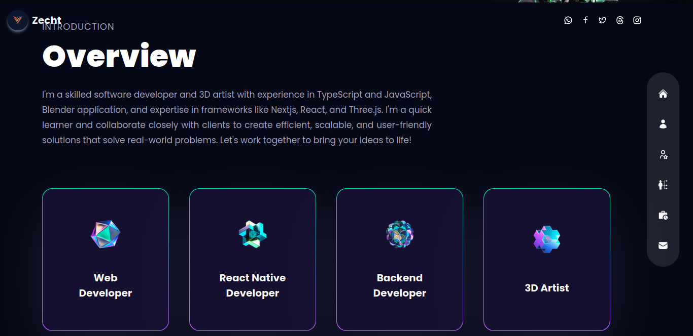
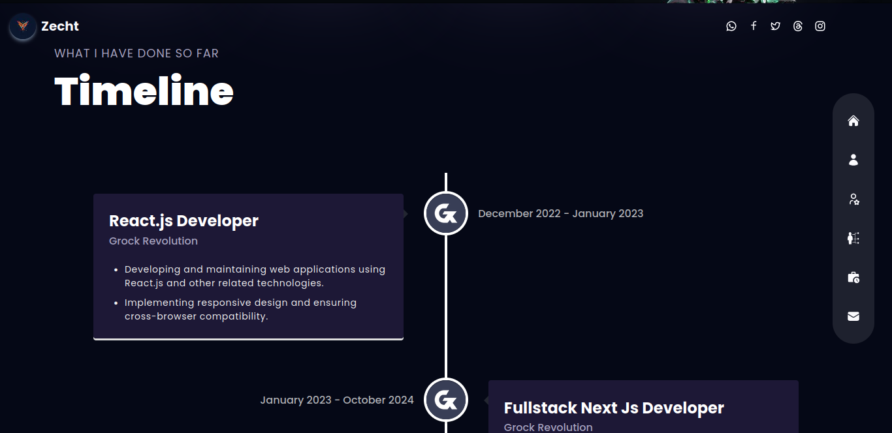
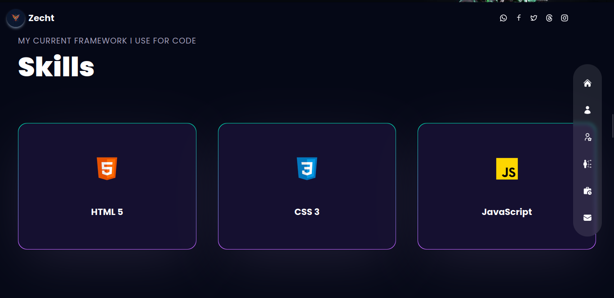

# Zecht Portfolio

Zecht Portfolio showcases the work and expertise of Gilang Prima Ertansyah, a full-stack web developer with a focus on building and designing web applications using modern technologies like Supabase and Prisma.

## Screenshots

### Screenshot 1

**Description:**
The first screenshot presents the landing page of Zecht Portfolio. The page welcomes visitors with a bold greeting, "Hi, I'm Zecht," followed by a brief introduction. It states that the developer's real name is Gilang Prima Ertansyah and highlights his expertise as a full-stack web developer, especially in building and designing websites. The introduction mentions his recent focus on developing responsive web applications using Supabase and Prisma. The background features a visually appealing, dark-themed design with a swirling pattern, and there is a vertical navigation bar on the right with icons for home, profile, projects, and contact information. Additionally, there are links to social media profiles in the top right corner. This screenshot emphasizes a professional and modern aesthetic, reflecting the developer's skills and areas of focus.

### Screenshot 2

**Description:**
The second screenshot provides an overview of Gilang Prima Ertansyah's skills and expertise. It starts with an "Overview" section that describes him as a skilled software developer and 3D artist with experience in TypeScript and JavaScript, Blender application, and frameworks like Next.js, React, and Three.js. The description highlights his ability to create efficient, scalable, and user-friendly solutions that solve real-world problems. Below the overview text, there are four highlighted roles: Web Developer, React Native Developer, Backend Developer, and 3D Artist, each represented by an icon. This page has a clean and organized layout, making it easy for visitors to understand the developer's capabilities and areas of specialization.

### Screenshot 3

**Description:**
The third screenshot illustrates the timeline of Gilang Prima Ertansyah's professional experience. The timeline showcases his roles and the duration of each position. Notably, it includes his tenure as a React.js Developer at Grock Revolution from December 2022 to January 2023, and as a Fullstack Next.js Developer at Grock Revolution from January 2023 to October 2024. Each role is briefly described, mentioning key responsibilities like developing and maintaining web applications using React.js and other technologies, and implementing responsive design and ensuring cross-browser compatibility. The timeline is visually represented with a vertical line connecting each role, providing a clear and structured overview of his career progression.

### Screenshot 4

**Description:**
The fourth screenshot provides an exhaustive list of Gilang Prima Ertansyah's skills and proficiencies. It highlights expertise in various technologies and tools essential for web development and design. The listed skills include:

- HTML
- JavaScript
- CSS
- Figma
- Next.js
- React
- Supabase
- Prisma
- Tailwind CSS
- Node.js
- Git

Each skill is crucial for different aspects of web development, ranging from front-end design with HTML, CSS, and JavaScript to backend development with Node.js, database management with Supabase and Prisma, and version control with Git. Additionally, tools like Figma aid in design prototyping, while frameworks like Next.js and React streamline web application development. This comprehensive list showcases the diverse skill set of Gilang Prima Ertansyah, highlighting his capability to handle various aspects of web development projects efficiently.

### Screenshot 5

**Description:**
The fifth screenshot showcases projects developed by Gilang Prima Ertansyah, providing real-world examples of his skills and experience. Each project is briefly described with links to code repositories and live demos. It demonstrates his ability to solve complex problems, work with various technologies, and effectively manage projects. 

#### Literacrypto Dev

**Description:**
Literacrypto Dev is a web application designed for our crypto class membership. It offers various opportunities such as call coin, airdrop, and more. The project utilizes technologies like Next.js, Supabase, and Prisma.

- [Source Code](https://github.com/zecht12/literacrypto)
- [Live Demo](https://literacrypto.vercel.app/)

#### Zechtnime Dev

**Description:**
Zechtnime Dev is a web application for displaying anime images, including fan art and some 18+ content. The project utilizes technologies like Next.js, Supabase, and Prisma.

- [Source Code](https://github.com/zecht12/Learning-2fa)
- [Live Demo](https://zechtnime.site/)

### Screenshot 6

**Description:**
The sixth screenshot provides a section for users to get in touch with Gilang Prima Ertansyah. It includes fields for users to input their name, email, and message, allowing them to easily reach out for inquiries or collaborations.

## Get in Touch

To contact Gilang Prima Ertansyah, you can fill out the form provided in the screenshot or use the following information:

- **Name:** [Your Name]
- **Email:** [Your Email]
- **Message:** [Your Message]

Feel free to reach out for any inquiries, collaborations, or questions regarding Gilang Prima Ertansyah's work.

## Features

- Full-stack web development
- Responsive web application design
- Expertise in Supabase and Prisma
- Proficiency in TypeScript, JavaScript, Next.js, React, and Three.js
- Project management and problem-solving skills

## Getting Started

To learn more about Gilang Prima Ertansyah and his work, visit the [Zecht Portfolio](https://zechtporto.vercel.app).

## Contributing

Contributions to improve the portfolio are welcome. Please submit a pull request or open an issue to discuss your ideas.

## License

This project is licensed under the MIT License - see the [LICENSE](LICENSE) file for details.
